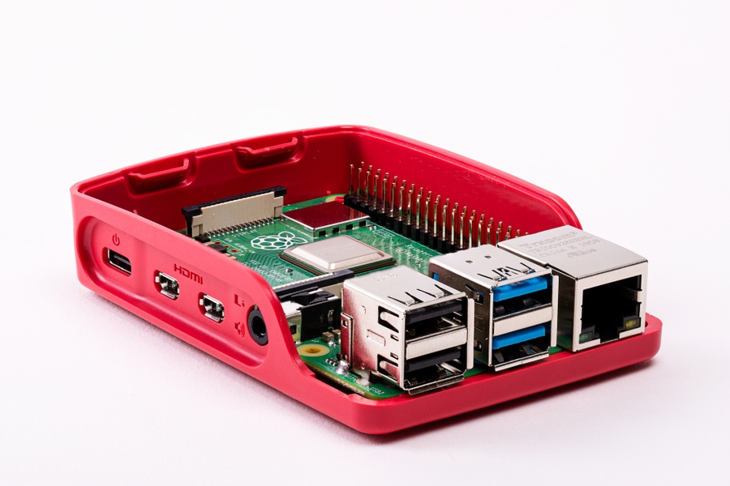

.. DeepStack documentation master file, created by
   sphinx-quickstart on Sun Nov  8 22:05:48 2020.
   You can adapt this file completely to your liking, but it should at least
   contain the root `toctree` directive.

Using DeepStack with Arm64 Devices
==================================

DeepStack is available on all Arm64 devices including Raspberry PI, Qualcomm DragonBoard 410c, AWS Graviton Servers and any device with a Arm64 
processor and a Linux 64 Bit OS.

*Note for Raspberry PI Users:* While Raspberry uses a 64 bit processor, Raspbian OS is 32 bit, to run DeepStack on Raspberry PI, you should install the 
64 Bit Raspbian Image, find it here `Raspbian OS 64 Bit Images <https://downloads.raspberrypi.org/raspios_arm64/images/>`_ 
you can also install a 64 Bit OS such as Balena OS and Ubuntu Server.

*Recommeded Hardware Spec:* While DeepStack can run successfully on a 1GB Ram device, we recommend using a device with 8GB Ram for good performance.

Follow the steps below to install DeepStack on a Arm64 device.

Step 1: Install Docker
----------------------

If you already have docker installed, you can skip this step.

.. code-block:: bash

    sudo apt-get update
    sudo apt-get install curl
    curl -fsSL get.docker.com -o get-docker.sh && sh get-docker.sh

Step 2: Install DeepStack
-----------------------------------------

.. code-block:: bash

    sudo docker pull deepquestai/deepstack:arm64-2021.09.1

Step 3: RUN DeepStack
-------------------------------------

.. code-block:: bash

    sudo docker run -e VISION-DETECTION=True -p 80:5000 deepquestai/deepstack:arm64-2021.09.1

To run with the face apis, simply use -e **VISION-FACE=True** instead, for scene, use -e **VISION-SCENE=True**.

*Basic Parameters*

**-e VISION-DETECTION=True** This enables the detection API.

**-p 80:5000** This makes DeepStack accessible via port 80 of the machine.

Once installed, run the example detection code to verify your installation is working.

RUN with All APIs
-----------------

You can run DeepStack with all the APIs enabled. Use the command below

.. code-block:: bash

    sudo docker run -e VISION-SCENE=True -e VISION-DETECTION=True -e VISION-FACE=True  -p 80:5000 deepquestai/deepstack:arm64-2021.09.1
    

.. toctree::
   :maxdepth: 2
   :caption: Contents:

* :ref:`genindex`
* :ref:`modindex`
* :ref:`search`
