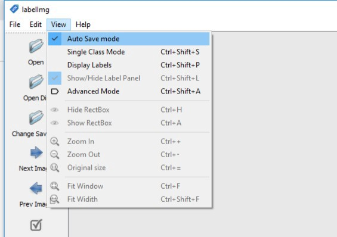
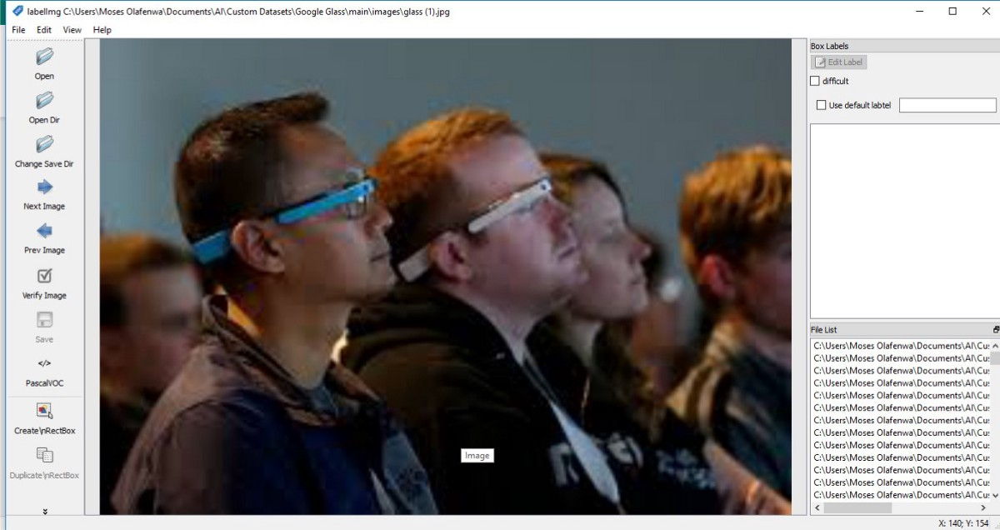
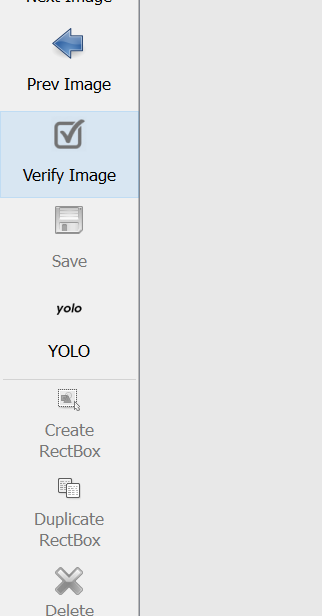
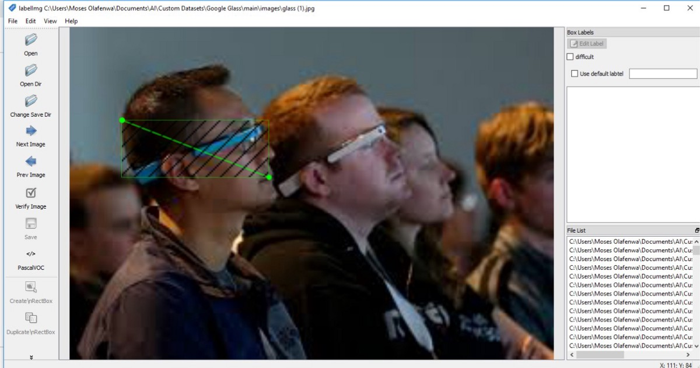
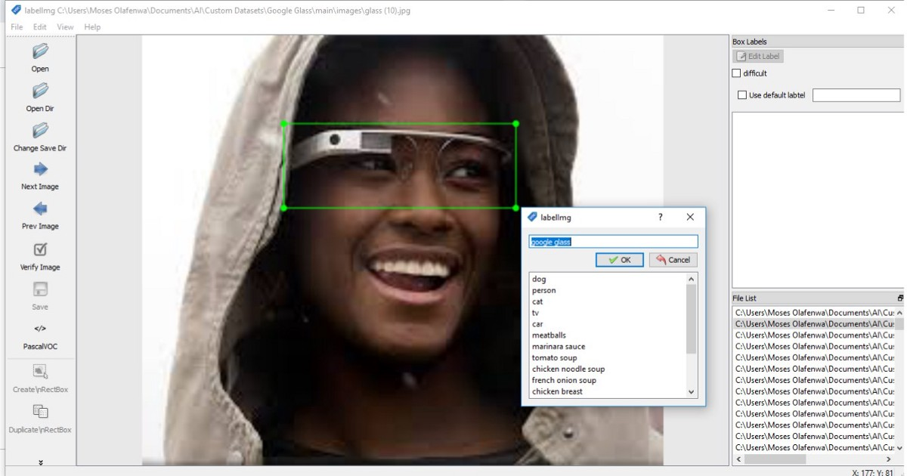

.. deepstack-python documentation master file, created by
   sphinx-quickstart on Sun Nov  8 22:05:48 2020.
   You can adapt this file completely to your liking, but it should at least
   contain the root `toctree` directive.

Preparing Your Dataset
=======================
To train your object detection model, you need to prepare your dataset in the YOLO format. To do this, we shall use LabelIMG,
an open source tool that makes the process simpler.

Step 1: Install LabelIMG
=========================

* FOR WINDOWS

    Install Python3 via https://www.python.org
    Install PyQt5 and lxml via PIP

    .. code-block:: bash

        pip3 install pyqt5 lxml

    Download and unzip the file via https://github.com/johnolafenwa/DeepStack/releases/download/1.0/labelimgwindows.zip

* For MacOS

    Clone the LabelImg repository

    .. code-block:: bash

        git clone https://github.com/tzutalin/labelImg.git

    CD to the Repo and run the commands below

    .. code-block:: bash

        pip3 install pyqt5 lxml # Install qt and lxml by pip
        make qt5py3

* For Linux
    
    Install LabelImg via PIP

    .. code-block:: bash

        pip3 install labelimg

Step 2: Organize Your Dataset
==============================
Collect as many images as you can containing the object you want to detect. About 300 images for training and 50 images for testing is suggested for good results. If you can collect thousands, that's even better. 
You can source images from the web or from your camera feeds as applicable.

* Create a new folder for your dataset
* create train and validation folders inside it
* Put all your training images inside the train folder
* Put all your test images inside your validation folder

Your Directory Structure should look like this

 My-Dataset:

 - - - - - train (90% of your images goes here)

 - - - - - test (put about 10% of your images here)

Step 3: Run LabelIMG
====================
* On Windows

Run the file LabelImg.exe that you unzipped earlier

* On MacOS

CD to the repo you cloned earlier and run

.. code-block:: bash

    python3 labelImg.py

* On Linux 

Run

.. code-block:: bash

    python3 labelimg

.. figure:: ../../static/labelimg.jpeg

Go to your LabelImg menu, select "View" and make sure "Auto Save Mode" is checked.

Click on "Open Dir" on the top-left and select your "train" directory where your training images are kept. The first image in your folder will be shown as seen in the example below.

Click on the "Change Save Dir" on the top-left and select your "train" folder. The annotation files will be saved alongside your images.

Change Annotation to YOLO Format
================================
Click on Pascal/VOC to change it to YOLO format

FROM 

.. figure:: ../../static/pascal.png

TO 

Step 4: Annotate Your Dataset
=============================
Now that you have loaded your images, set the save folder for the annotations and switched to the yolo format, we shall annotate our dataset. In this example, we are using an image dataset on Google Glass.

.. figure:: ../../static/googleglasss.png

Start annotating your images by:

Click on the "Create \nRectBox" button on the left-bottom and draw a box around the objects you want to annotate as seen in the images below.

* Click on the "Create \nRectBox" button again and annotate all the objects in the image.
* Once you are done, click the "Next Image" button on the middle-left to annotate the another image.

.. figure:: ../../static/annotate3.jpeg

As you are annotating your images, the XML file containing your box annotations are saved for each image in the "train" folder. 

N.B: Take note that the annotation XML file for each image is saved using the name of the image file. For example:
you have images image_1.jpg, image_2.jpg …… image_z.jpg
the XML annotations file will be saved as image_1.xml, image_2.xml,…. image_z.xml

Annotate Your Test Dataset
==========================
Repeat the process above for your test folder as well.

