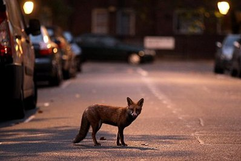

.. DeepStack documentation master file, created by
   sphinx-quickstart on Sun Nov  8 22:05:48 2020.
   You can adapt this file completely to your liking, but it should at least
   contain the root `toctree` directive.

Image Enhance
=============

The image enhance API enlarges your image by 4X the original width and height, while simulatenously increasing the quality of the image. 

To use this API, you need to enable the Enhance API when starting DeepStack

Starting DeepStack
------------------

Run the command below as it applies to the version you have installed

.. tabs::

  .. code-tab:: bash Docker CPU

    sudo docker run -e VISION-ENHANCE=True -v localstorage:/datastore -p 80:5000 deepquestai/deepstack
  
  .. code-tab:: bash Docker GPU

    sudo docker run --gpus all -e VISION-ENHANCE=True -v localstorage:/datastore -p 80:5000 deepquestai/deepstack:gpu

  .. code-tab:: bash Windows OS

    deepstack --VISION-ENHANCE True --PORT 80
  
  .. code-tab:: bash NVIDIA Jetson

    sudo docker run --runtime nvidia -e VISION-ENHANCE=True -p 80:5000 deepquestai/deepstack:jetpack

  .. code-tab:: bash ARM64

    sudo docker run -e VISION-ENHANCE=True -v localstorage:/datastore -p 80:5000 deepquestai/deepstack:arm64

  .. code-tab:: bash ARM64 Server

    sudo docker run -e VISION-ENHANCE=True -v localstorage:/datastore -p 80:5000 deepquestai/deepstack:arm64-server

*Basic Parameters*

**-e VISION-ENHANCE=True** This enables the image enhance API.

**-v localstorage:/datastore** This specifies the local volume where DeepStack will store all data.

**-p 80:5000** This makes DeepStack accessible via port 80 of the machine.

**Example**

*Sample Image*

.. figure:: ../static/sky.jpg

.. tabs::

    .. code-tab:: python

        import requests
        import base64

        image_data = open("sky.jpg","rb").read()

        response = requests.post("http://localhost:80/v1/vision/enhance",files={"image":image_data}).json()

        print(response)
        if response["success"] == True:
            enhance_base64 = response["base64"]
            image4X_byte = base64.b64decode(enhance_base64)

            # Write enhanced image to file
            with open(r"sky-4X.jpg", 'wb') as f_output:
                f_output.write(image4X_byte)
    
    .. code-tab:: js

        const request = require("request")
        const fs = require("fs")

        image_stream = fs.createReadStream("test-image3.jpg")

        var form = {"image":image_stream}

        request.post({url:"http://localhost:80/v1/vision/enhance", formData:form},function(err,res,body){

            response = JSON.parse(body)
            predictions = response["predictions"]
            for(var i =0; i < predictions.length; i++){

                console.log(predictions[i]["label"])

            }

            console.log(response)
        })
    
    .. code-tab:: c#

        using System;
        using System.IO;
        using System.Net.Http;
        using System.Threading.Tasks;
        using Newtonsoft.Json;

        namespace appone
        {

        class Response {

            public bool success {get;set;}
            public Object[] predictions {get;set;}

        }

        class Object {

            public string label {get;set;}
            public float confidence {get;set;}
            public int y_min {get;set;}
            public int x_min {get;set;}
            public int y_max {get;set;}
            public int x_max {get;set;}

        }

        class App {

            static HttpClient client = new HttpClient();

            public static async Task detectFace(string image_path){

                var request = new MultipartFormDataContent();
                var image_data = File.OpenRead(image_path);
                request.Add(new StreamContent(image_data),"image",Path.GetFileName(image_path));
                var output = await client.PostAsync("http://localhost:80/v1/vision/enhance",request);
                var jsonString = await output.Content.ReadAsStringAsync();
                Response response = JsonConvert.DeserializeObject<Response>(jsonString);

                foreach (var user in response.predictions){

                    Console.WriteLine(user.label);

                }

                Console.WriteLine(jsonString);

            }

            static void Main(string[] args){

                detectFace("test-image3.jpg").Wait();

            }

        }

        }

**Response**

.. code-block:: text

    {
        "success": True,
        "base64": ".........mabKicgSdq/3fSo6UfcH0pATmhEgST3phPHNKe1RuetUJn//2Q==",
        "width": 1840
        "height": 1036
    }

The API returns a Base64 string which you can decode to get the 4 times enhanced output of the original image. It also returns the width and height of the enhanced image.

*Enhanced Output*

.. figure:: ../static/sky-4X.jpg
    :scale: 80 %

*More Sample Images*

**

*Enhanced Outputs*

.. figure:: ../static/car-park-4X.jpg
    :scale: 80 %

**

.. figure:: ../static/fox-4X.jpg
    :scale: 80 %

.. toctree::
   :maxdepth: 2
   :caption: Contents:

* :ref:`genindex`
* :ref:`modindex`
* :ref:`search`
