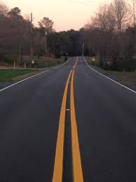

.. DeepStack documentation master file, created by
   sphinx-quickstart on Sun Nov  8 22:05:48 2020.
   You can adapt this file completely to your liking, but it should at least
   contain the root `toctree` directive.

DeepStack Documentation!
========================

Official Documentation and Guide for DeepStack AI Server.
---------------------------------------------------------

**DeepStack** is an AI server that empowers every developer in the world to easily build state-of-the-art AI systems both on premise and in the cloud. The promises of Artificial Intelligence are huge but becoming a machine learning engineer is hard. **DeepStack** is device and language agnostic. You can run it on **Windows**, **Mac OS**, **Linux**, **Raspberry PI** and use it with any programming language.

**DeepStack** is developed and maintained by `DeepQuest AI <https://deepquestai.com>`_ .

Top Features
=============
* `FACE DETECTION & RECOGNITION <face-recognition>`_
* `OBJECT DETECTION <object-detection>`_
* `SCENE RECOGNITION <scene-recognition>`_
* `SUPPORT FOR CUSTOM OBJECT DETECTION <custom-models>`_
* `IN-BUILT SECURITY <security>`_
* `API REFERENCE <api-reference>`_

Example Code
============

Using DeepStack, we can classify the scene of the above image as seen below.

.. tabs::

  .. code-tab:: python

    import requests

    image_data = open("image.jpg","rb").read()

    response = requests.post("http://localhost:80/v1/vision/scene",
    files={"image":image_data}).json()
    print(response)

  .. code-tab:: js

    const request = require("request")
    const fs = require("fs")

    image_stream = fs.createReadStream("image.jpg")

    var form = {"image":image_stream}

    request.post({url:"http://localhost:80/v1/vision/scene", formData:form},function(err,res,body){

        response = JSON.parse(body)
        console.log(response)
    })
  
  .. code-tab:: c#

    using System;
    using System.IO;
    using System.Net.Http;
    using System.Threading.Tasks;

    namespace app
    {

        class App {

        static HttpClient client = new HttpClient();

        public static async Task makeRequest(){

            var request = new MultipartFormDataContent();
            var image_data = File.OpenRead("image.jpg");
            request.Add(new StreamContent(image_data),"image",Path.GetFileName("image.jpg"));
            var output = await client.PostAsync("http://localhost:80/v1/vision/scene",request);
            var jsonString = await output.Content.ReadAsStringAsync();

            Console.WriteLine(jsonString);

        }

        static void Main(string[] args){

            makeRequest().Wait();

        }

        }

    }

**Response**

.. code-block:: json

  { 'success': true, label: 'highway', confidence: 0.63377846 }

Installation
============

**DeepStack** is available in three variants, **CPU Version**, **GPU Version**, **NVIDIA Jetson** and **Raspberry PI Version** (With Support for Intel Neural Compute Stick)

`Installation Guide for GPU Version <using-deepstack-with-nvidia-gpus>`_

`Installation Guide for NVIDIA Jetson <nvidia-jetson>`_

`Installation Guide for Windows ( CPU and GPU ) <windows>`_

`Installation Guide for Raspberry Pi <raspberry-pi>`_

Installation Guide for CPU Version
----------------------------------

Step 1: Install Docker (If not already installed)
Mac OS and Windows Users can install docker from `Docker's Website <https://www.docker.com/products/docker-desktop>`_ .

To install on a **Linux** operating system, run the commands below

.. code-block:: bash

  sudo apt-get update
  sudo apt-get install docker.io

Step 2: Install DeepStack

.. code-block:: bash

  docker pull deepquestai/deepstack

Run DeepStack with Scene Recognition API enabled
------------------------------------------------

Run the command below as it applies to the version you have installed

.. tabs::

  .. code-tab:: bash Docker CPU

    docker run -e VISION-SCENE=True -v localstorage:/datastore -p 80:5000 deepquestai/deepstack
  
  .. code-tab:: bash Docker GPU

    sudo docker run --gpus all -e VISION-SCENE=True -v localstorage:/datastore -p 80:5000 deepquestai/deepstack:gpu

  .. code-tab:: bash Windows OS

    deepstack --VISION-SCENE True --PORT 80
  
  .. code-tab:: bash NVIDIA Jetson

    sudo docker run --runtime nvidia -e VISION-SCENE=True -p 80:5000 deepquestai/deepstack:jetpack
  
  .. code-tab:: bash Raspberry Pi

    sudo deepstack start "VISION-SCENE=True"

*Basic Parameters*

**-e VISION-SCENE=True** This enables the scene recognition API.

**-p 80:5000** This makes DeepStack accessible via port 80 of the machine.

Run the **example scene recognition** code at the begining of this page to verify your installation is working.

.. toctree::
   :maxdepth: 2
   :caption: Contents:

   getting-started/index
   face-recognition/index
   face-detection/index
   face-match/index
   object-detection/index
   scene-recognition/index
   custom-models/index
   security/index
   backup/index
   using-deepstack-with-nvidia-gpus/index
   windows/index
   nvidia-jetson/index
   raspberry-pi/index
   best-practices/index
   api-reference/index
   release-notes/index

* :ref:`genindex`
* :ref:`modindex`
* :ref:`search`
