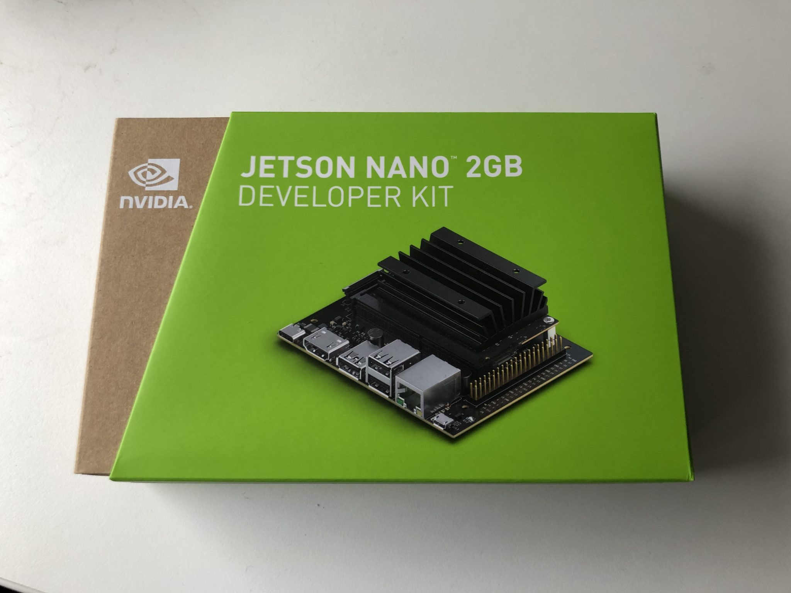

.. DeepStack documentation master file, created by
   sphinx-quickstart on Sun Nov  8 22:05:48 2020.
   You can adapt this file completely to your liking, but it should at least
   contain the root `toctree` directive.

Using DeepStack with NVIDIA Jetson
==================================

DeepStack GPU Version is available for the full range of Jetson Devices, from the 2GB Nano edition to the higher end jetson devices.

Follow the steps below to install DeepStack on a Jetson device.

Step 1: Install Docker
----------------------

If you already have docker installed, you can skip this step.

.. code-block:: bash

    sudo apt-get update
    sudo apt-get install curl
    curl -fsSL get.docker.com -o get-docker.sh && sh get-docker.sh

Step 2: Install DeepStack GPU for Jetson
-----------------------------------------

.. code-block:: bash

    sudo docker pull deepquestai/deepstack:jetpack-2021.06.1

Step 3: RUN DeepStack GPU on Jetson
-------------------------------------

Once the above steps are complete, when you run DeepStack, add the args **–gpus all**

.. code-block:: bash

    sudo docker run --runtime nvidia -e VISION-DETECTION=True -p 80:5000 deepquestai/deepstack:jetpack-2021.06.1

To run with the face apis, simply use -e **VISION-FACE=True** instead, for scene, use -e **VISION-SCENE=True**.

*Basic Parameters*

**--runtime nvidia** This enables gpu access to the DeepStack container

**-e VISION-DETECTION=True** This enables the detection API.

**-p 80:5000** This makes DeepStack accessible via port 80 of the machine.

Once installed, run the example detection code to verify your installation is working.

RUN with All APIs
-----------------

You can run DeepStack with all the APIs enabled. Use the command below

.. code-block:: bash

    sudo docker run --runtime nvidia -e VISION-SCENE=True -e VISION-DETECTION=True -e VISION-FACE=True  -p 80:5000 deepquestai/deepstack:jetpack-2021.06.1
    

.. toctree::
   :maxdepth: 2
   :caption: Contents:

* :ref:`genindex`
* :ref:`modindex`
* :ref:`search`
