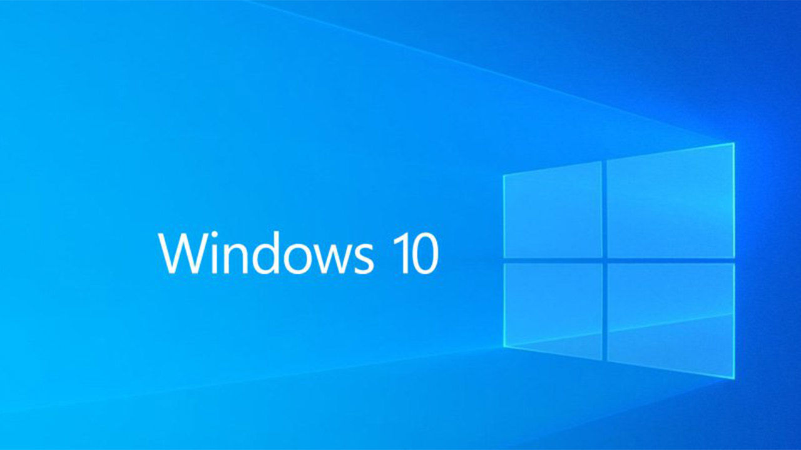

.. DeepStack documentation master file, created by
   sphinx-quickstart on Sun Nov  8 22:05:48 2020.
   You can adapt this file completely to your liking, but it should at least
   contain the root `toctree` directive.

Using DeepStack with Windows 10 (CPU and GPU)
=============================================

DeepStack CPU and GPU Version is now available for the Windows operating System.

Install DeepStack CPU
----------------------

Click the link below to download DeepStack CPU version for Windows.

`>> Download CPU version for Windows <https://deepquest.sfo2.digitaloceanspaces.com/deepstack/DeepStack-Installer-CPU-2022.01.1.exe>`_

Once downloded, run the downloaded **.exe** file and install on your Windows machine.

Install DeepStack GPU
----------------------

To install and use DeepStack GPU version on your Windows machine, follow the steps below

- Ensure your machine has an NVIDIA GPU

- Download and Install `CUDA 11.3.1 from NVIDIA <https://developer.nvidia.com/cuda-11-3-1-download-archive>`_

- Download and Install `cuDNN from NVIDIA <https://developer.nvidia.com/cudnn>`_ 

Once the above are installed, download and run DeepStack GPU version for windows via the link below.

`>> Download GPU version for Windows <https://deepquest.sfo2.digitaloceanspaces.com/deepstack/DeepStack-Installer-GPU-2022.01.1.exe>`_

Using DeepStack on Windows
--------------------------

To start DeepStack on Windows, open **PowerShell** and run the command below to start Detection API

.. code-block:: bash

    deepstack --VISION-DETECTION True --PORT 80

For Face API and Scene API, set **--VISION-FACE True** and **--VISION-SCENE True** respectively.

Custom Models
-------------
For custom models, add **--MODELSTORE-DETECTION** to your command as seen in the sample below

.. code-block:: bash

    deepstack --MODELSTORE-DETECTION "C:/path-to-detection-models" --PORT 80

RUN with All APIs
-----------------

You can run DeepStack with all the APIs enabled. Use the command below

.. code-block:: bash

    deepstack --VISION-SCENE=True --VISION-DETECTION=True --VISION-FACE=True --PORT 80

Speed Modes
-----------

For speed modes, add **--MODE mode** (where mode can be **High**, **Medium** and **Low** )  to your command as seen in the sample below

.. code-block:: bash

    deepstack --VISION-DETECTION True --MODE High --PORT 80

API and Admin Keys
------------------
For API and Admin keys, add **--API-KEY** and **--ADMIN-KEY** respectively to your command as seen in the sample below

.. code-block:: bash

    deepstack --VISION-DETECTION True --PORT 80 --API-KEY MyPassword --ADMIN-KEY MyAdminPassword

.. toctree::
   :maxdepth: 2
   :caption: Contents:

* :ref:`genindex`
* :ref:`modindex`
* :ref:`search`
